# AWS S3 → Glue Event-Driven ETL Pipeline

## Overview

This project implements a simple event-driven ETL pipeline on AWS.

A CSV file is uploaded to the **Input S3 bucket**. The upload creates an S3 event that flows through **EventBridge → Lambda → AWS Glue Workflow**. Glue crawlers update the Data Catalog, the Glue Python Shell job transforms the data, and the processed file is written to the **Output S3 bucket**.

The infrastructure is deployed using **CloudFormation**, while **GitHub Actions** provides the CI/CD automation.

---

## Architecture

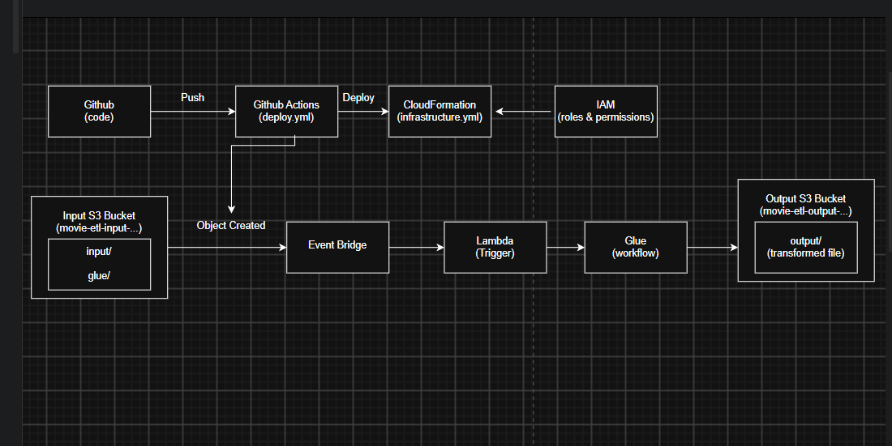

### High-level flow

```text
GitHub
   │
   ▼
GitHub Actions
   │
   ├── Deploys CloudFormation infrastructure
   └── Uploads Glue ETL script
            │
            ▼
       Input S3 Bucket
            │
       Object Created
            ▼
        EventBridge
            │
            ▼
          Lambda
            │
            ▼
     Glue Workflow
       │       │
       │       └── Glue Job
       │              │
       ▼              ▼
 Input Crawler     Output S3
       │
       ▼
 AWS Glue Data Catalog
```

---

## AWS Services Used

| Service | Purpose |
|---|---|
| **Amazon S3** | Stores input CSV files, Glue script, and transformed output |
| **Amazon EventBridge** | Detects object-created events in the input S3 bucket |
| **AWS Lambda** | Starts the Glue workflow when an input file is uploaded |
| **AWS Glue Workflow** | Orchestrates crawler → ETL job → output crawler |
| **AWS Glue Python Shell Job** | Cleans and transforms the CSV data |
| **AWS Glue Crawlers** | Discovers table schemas from input/output data |
| **AWS Glue Data Catalog** | Stores metadata for the crawled datasets |
| **AWS CloudFormation** | Creates and manages the AWS infrastructure |
| **GitHub Actions** | Automates deployment and cleanup |
| **AWS IAM** | Provides least-privilege roles and permissions |
| **CloudWatch Billing Alarm** | Monitors estimated AWS charges |

---

# 1. Repository Structure

```text
s3-glue-event-pipeline/
│
├── .github/
│   └── workflows/
│       ├── deploy.yml
│       └── destroy.yml
│
├── cloudformation/
│   ├── infrastructure.yaml
│   └── cicd.yaml
│
├── glue/
│   └── glue_job.py
│
├── lambda/
│   └── lambda_function.py
│
├── sample-data/
│   └── sample.csv
│
├── diagrams/
│
├── docs/
│   └── screenshots/
│       ├── Alarms.png
│       ├── AWS_glue_tables_input.png
│       ├── Crawlers_completion_ss.png
│       ├── Data_catalog_tables.png
│       ├── Event_bridge_upload_trigger.png
│       ├── Glue_monitoring_workflow.png
│       ├── Glue_stack_complete.png
│       ├── Glue_tables_output.png
│       ├── Glue_workflow.png
│       ├── Initial_deploy_github_action.png
│       ├── input_S3_folder.png
│       ├── Lambda_function_overview.png
│       ├── OIDC_github.png
│       ├── Output_s3_folder.png
│       ├── Overall_Architecture_diagram.png
│       ├── Destroy_github_action.png
│       ├── Destroy_github_action (2).png
│       └── Final_deploy_after_destroy_github_action.png
│
├── buildspec.yml
├── lambda-response.json
├── .gitignore
└── README.md
```

---

# 2. CI/CD Deployment

The project uses GitHub Actions to deploy the AWS infrastructure.

The deployment workflow:

1. Code is pushed to the `main` branch.
2. GitHub Actions authenticates with AWS using GitHub OIDC.
3. The CloudFormation template is validated.
4. The CloudFormation stack is deployed.
5. S3 input and output folders are created.
6. The Glue ETL script is uploaded to the input bucket.
7. Deployment outputs are displayed.

### GitHub Actions deployment

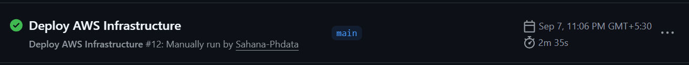

The successful final deployment after the infrastructure was recreated is shown below.

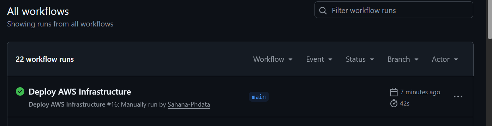

---

# 3. GitHub OIDC Authentication

GitHub Actions uses **OpenID Connect (OIDC)** to authenticate with AWS.

This avoids storing long-lived AWS access keys inside GitHub.

The GitHub OIDC provider and IAM role are configured so that the repository can assume the deployment role.

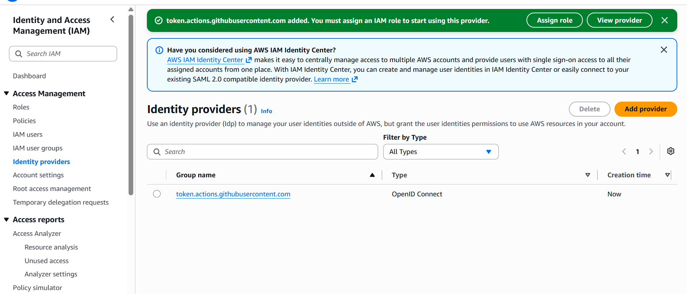

---

# 4. Infrastructure as Code

AWS resources are defined using **AWS CloudFormation**.

The main infrastructure template creates:

- Input S3 bucket
- Output S3 bucket
- EventBridge rule
- Lambda function
- Glue workflow
- Glue job
- Input crawler
- Output crawler
- Glue Data Catalog database
- IAM roles and policies

The CloudFormation stack was successfully created.

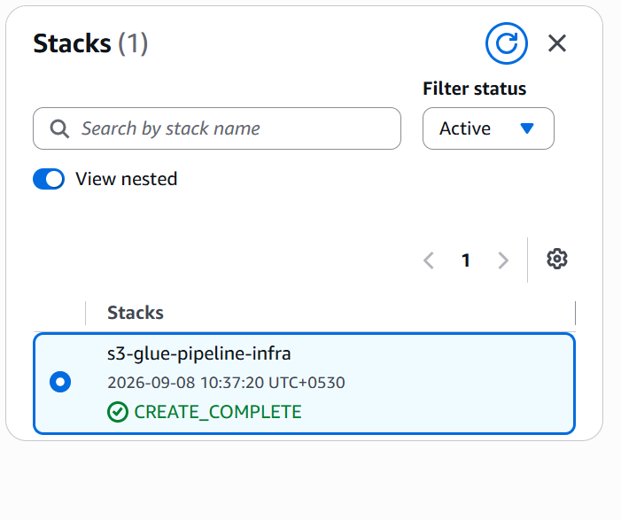

---

# 5. S3 Input and Output Buckets

The pipeline uses two separate S3 buckets.

### Input bucket

The input bucket contains the incoming CSV data and the Glue ETL script.

```text
input/
    movies.csv

glue/
    glue_job.py
```

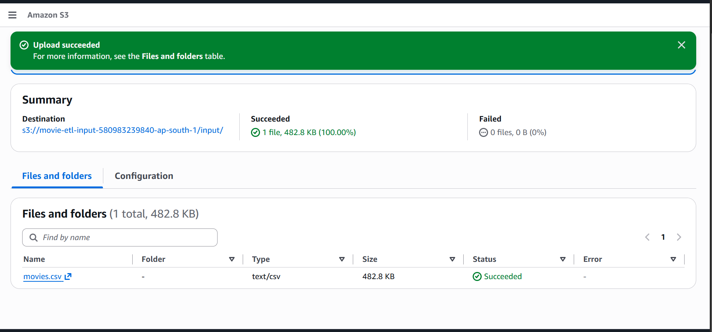

### Output bucket

The output bucket contains the transformed data.

```text
output/
    movies_transformed.csv
```

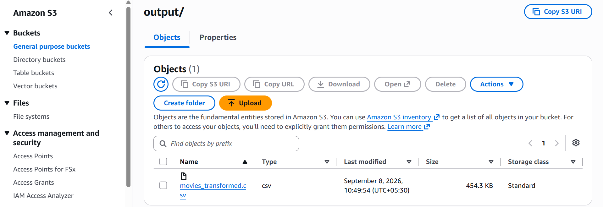

---

# 6. Event-Driven Trigger

When a CSV file is uploaded into the `input/` prefix of the Input S3 bucket, an **Object Created** event is generated.

The event is handled by Amazon EventBridge.

EventBridge then invokes the Lambda trigger.

```text
Input S3
   │
   │ Object Created
   ▼
EventBridge
   │
   ▼
Lambda
```

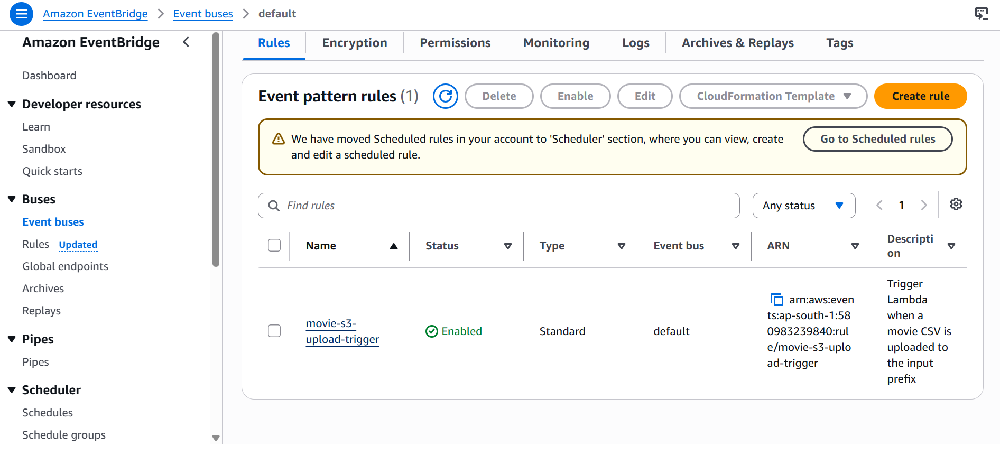

---

# 7. Lambda Trigger

The Lambda function acts as the bridge between EventBridge and AWS Glue.

Its main responsibility is to start the Glue workflow when a new input object is created.

```text
S3 Object Created
       │
       ▼
  EventBridge
       │
       ▼
     Lambda
       │
       ▼
 Glue Workflow
```

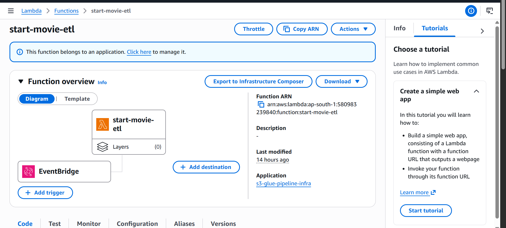

---

# 8. AWS Glue Workflow

The Glue workflow orchestrates the ETL process.

The workflow contains the following logical sequence:

```text
Input Crawler
     │
     ▼
Glue Python Shell Job
     │
     ▼
Output Crawler
```

The workflow allows the processing steps to run in the correct order.

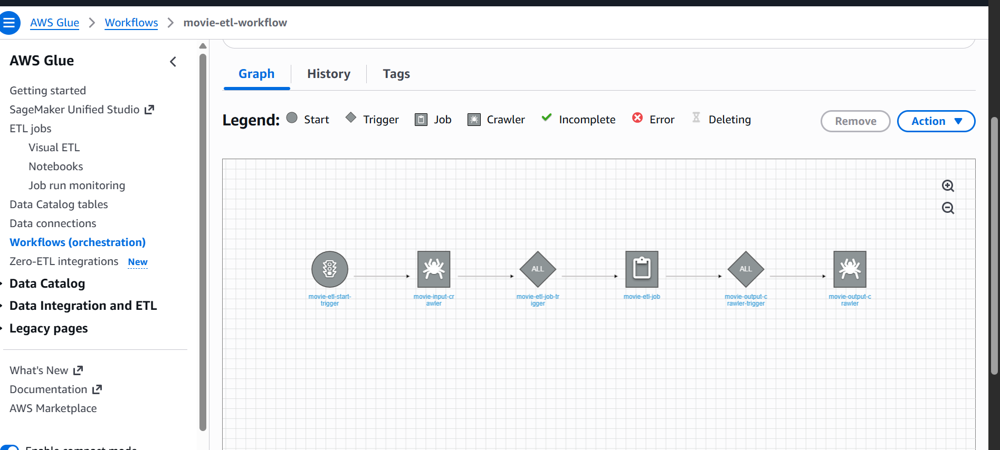

---

# 9. Glue Crawlers

Two Glue crawlers are used.

### Input Crawler

The input crawler scans the input data and creates/updates the corresponding table in the Glue Data Catalog.

### Output Crawler

After the transformation completes, the output crawler scans the transformed data and updates the output table in the Data Catalog.

The crawler executions completed successfully.

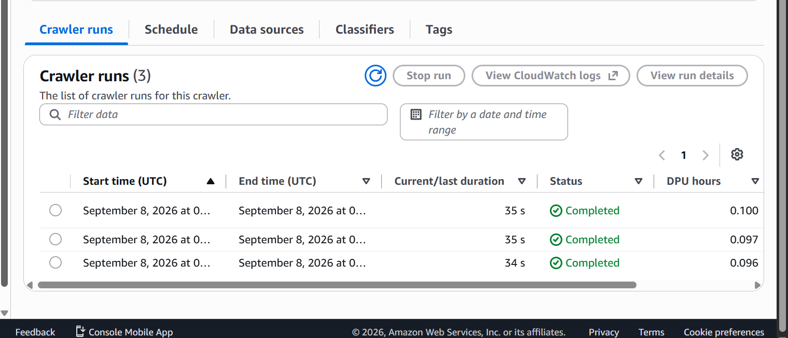

---

# 10. Glue Data Catalog

The crawlers populate metadata in the AWS Glue Data Catalog.

This allows the input and output datasets to be represented as catalog tables.

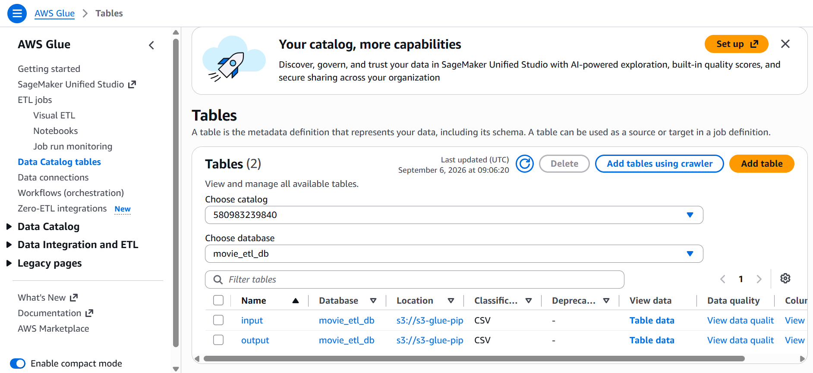

The input Glue table is shown below.

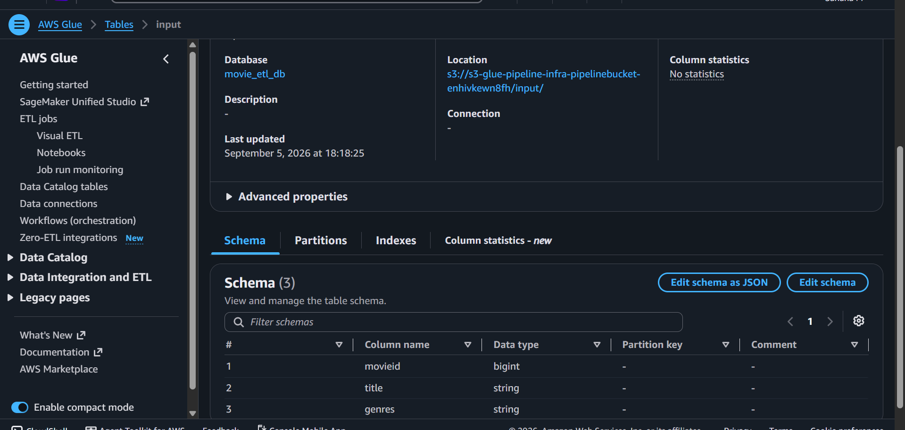

The output Glue table is shown below.

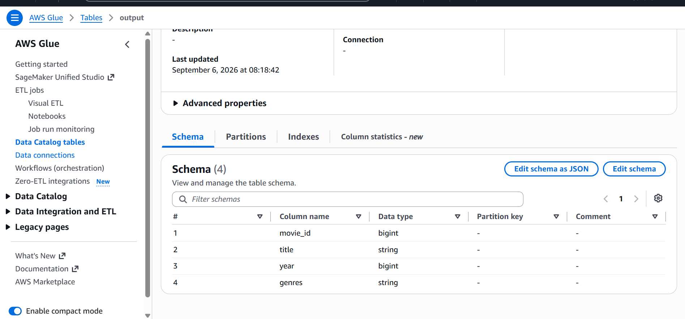

---

# 11. Glue ETL Transformation

The transformation is implemented using an **AWS Glue Python Shell job**.

The job:

1. Reads the input CSV.
2. Validates required columns.
3. Cleans the movie title.
4. Extracts the release year from the title.
5. Normalizes the title.
6. Writes the transformed CSV to the output S3 bucket.

### Input

Example input:

```text
movieId,title,genres
1,Toy Story (1995),Adventure|Animation|Children|Comedy|Fantasy
2,Jumanji (1995),Adventure|Children|Fantasy
```

### Output

The transformed data contains fields such as:

```text
movie_id,title,year,genres
```

The resulting file is written to:

```text
s3://<output-bucket>/output/movies_transformed.csv
```

---

# 12. Glue Monitoring

The Glue workflow and job execution can be monitored from the AWS Glue console.

The successful workflow execution is shown below.

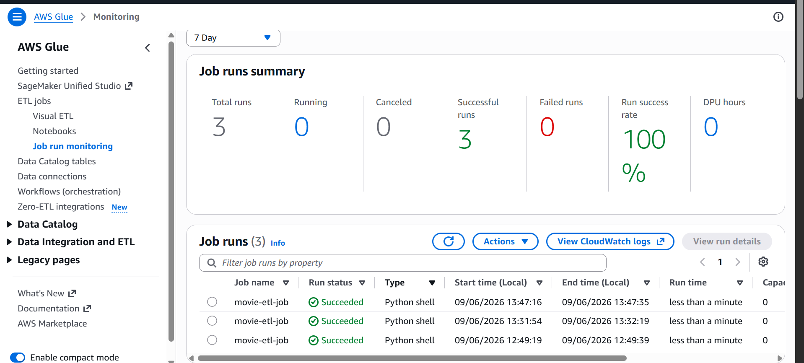

---

# 13. End-to-End Processing Flow

The complete runtime flow is:

```text
1. CSV uploaded to S3 input/
             │
             ▼
2. S3 Object Created event
             │
             ▼
3. EventBridge rule
             │
             ▼
4. Lambda trigger
             │
             ▼
5. Glue Workflow starts
             │
             ▼
6. Input Crawler
             │
             ▼
7. Glue Python Shell ETL Job
             │
             ▼
8. Transformed CSV written to S3 output/
             │
             ▼
9. Output Crawler
             │
             ▼
10. Output table updated in Glue Data Catalog
```

This provides an automated event-driven ETL pipeline without manually starting the Glue job.

---

# 14. IAM and Least Privilege

IAM roles are used to control access between the AWS services.

The deployment setup uses:

- GitHub OIDC deployment role
- CloudFormation execution role
- Lambda execution role
- Glue job role
- Glue crawler roles

Permissions are scoped to the resources required by each component instead of granting unrestricted access wherever possible.

The GitHub Actions workflow assumes the AWS deployment role through OIDC.

---

# 15. Billing Alarm

A CloudWatch billing alarm was configured to monitor estimated AWS charges.

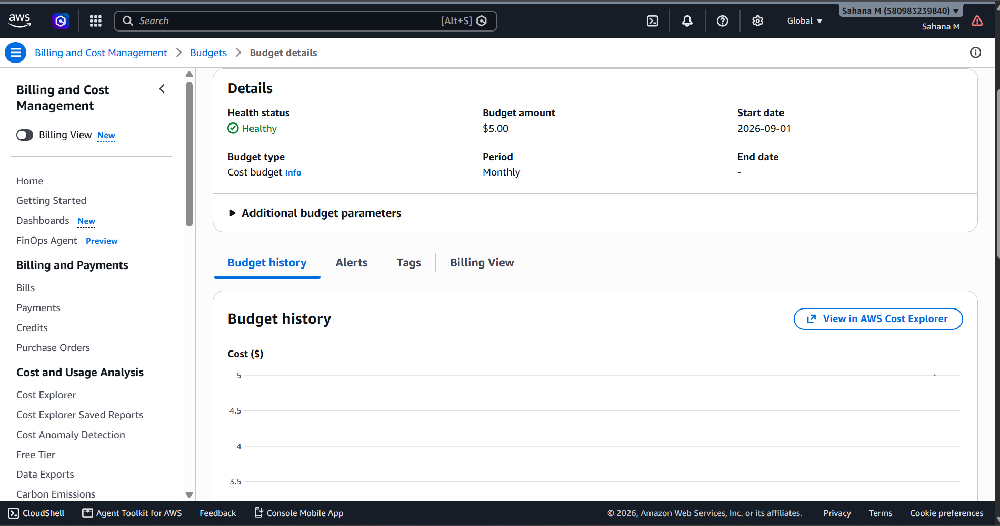

The alarm provides an additional safety mechanism to help detect unexpected AWS usage.

---

# 16. Cleanup

Because AWS resources can incur charges, a GitHub Actions cleanup workflow is included.

The cleanup process removes the deployed infrastructure and associated resources.

### Cleanup workflow


A subsequent cleanup/deployment verification is also documented below.

.png)

After cleanup, the infrastructure can be deployed again using the deployment workflow.

---

# 17. Key Features

- Event-driven ETL pipeline
- Separate S3 input and output buckets
- Automatic S3 → EventBridge → Lambda triggering
- AWS Glue Workflow orchestration
- Glue Python Shell transformation
- Input and output Glue Crawlers
- AWS Glue Data Catalog integration
- Infrastructure as Code using CloudFormation
- GitHub Actions CI/CD
- GitHub OIDC authentication
- IAM least-privilege approach
- CloudWatch billing monitoring
- Automated cleanup workflow

---

# 18. Technologies

**Cloud:** AWS

**Storage:** Amazon S3

**ETL:** AWS Glue Python Shell

**Orchestration:** AWS Glue Workflow

**Eventing:** Amazon EventBridge

**Compute:** AWS Lambda

**Metadata:** AWS Glue Data Catalog

**Infrastructure as Code:** AWS CloudFormation

**CI/CD:** GitHub Actions

**Authentication:** GitHub OIDC + AWS IAM

**Monitoring:** CloudWatch

---

# 19. Project Outcome

The project demonstrates a complete automated ETL workflow where infrastructure is deployed through CI/CD and data processing is triggered automatically by an S3 upload.

The final architecture is:

```text
              CI/CD
        GitHub → GitHub Actions
                     │
                     ▼
              CloudFormation
                     │
                     ▼
                  AWS
                     │
     ┌───────────────┴────────────────┐
     │                                │
 Input S3                       AWS Glue Pipeline
     │                                │
     ▼                                │
 EventBridge                         │
     │                                │
     ▼                                │
 Lambda ──────────────────────────────┘
                                      │
                                      ▼
                               Glue ETL Job
                                      │
                                      ▼
                                Output S3
                                      │
                                      ▼
                                Glue Catalog
```

---

## Conclusion

This project provides a simple, automated and reproducible AWS ETL pipeline.

Infrastructure is managed as code using CloudFormation, deployment is automated through GitHub Actions, and data processing is triggered automatically when a new CSV file arrives in the S3 input location.
